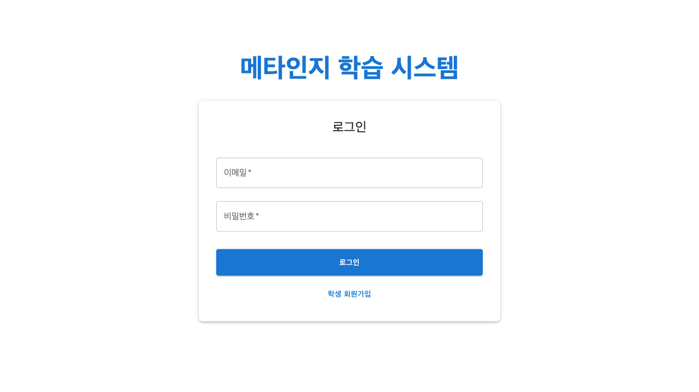
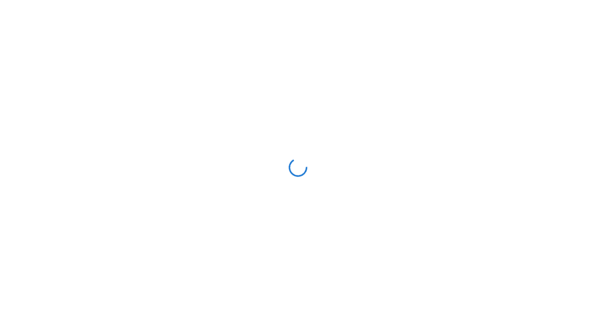
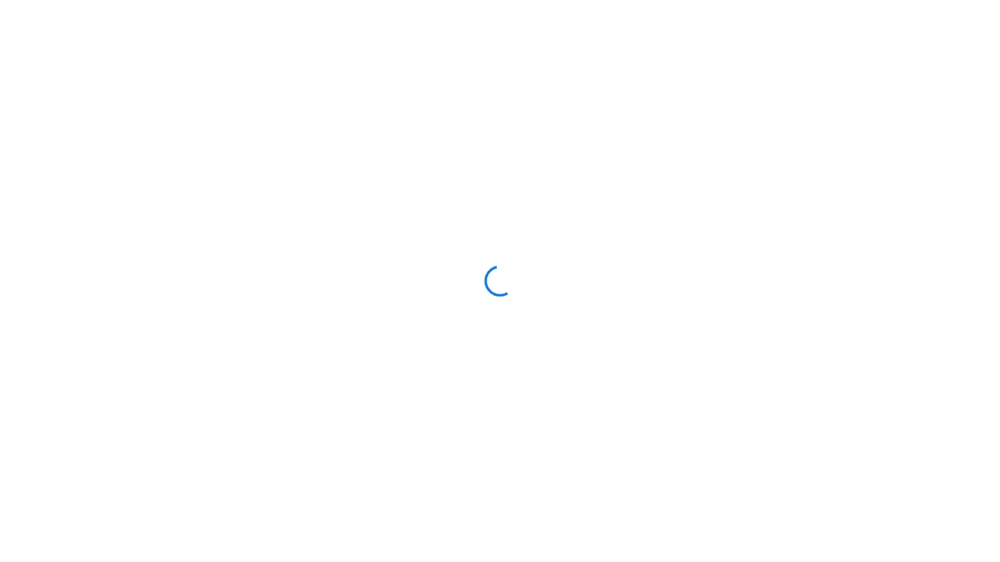

# 📸 Meta-Cog 기능별 스크린샷 가이드

## 1. 로그인 및 회원가입

### 로그인 화면

**주요 특징:**
- 간편한 이메일 로그인
- 소셜 로그인 지원 (Google)
- 역할 선택 (학생/교사)
- 비밀번호 찾기 기능

### 회원가입 프로세스
1. 이메일 입력
2. 비밀번호 설정
3. 역할 선택 (학생/교사)
4. 프로필 정보 입력
   - 이름
   - 학교
   - 학년 (학생의 경우)

---

## 2. 학생 대시보드

### 메인 대시보드

**구성 요소:**
1. **상단 헤더**
   - 사용자 이름 표시
   - 로그아웃 버튼

2. **탭 메뉴**
   - 학습 세션
   - 목표 선언
   - 리더보드
   - AI 조언

3. **학습 세션 탭**
   - 오늘의 학습 시간
   - 주간 학습 통계
   - 세션 기록 버튼
   - 최근 학습 세션 목록

### 세션 기록 기능
**세션 시작하기:**
1. "새 세션 시작" 버튼 클릭
2. 과목 선택
3. 학습 목표 입력
4. 타이머 자동 시작

**세션 종료하기:**
1. "세션 종료" 버튼 클릭
2. 학습 내용 요약 입력
3. 난이도 평가 (1-5)
4. 완료

---

## 3. 목표 선언 광장

### 목표 선언 화면

**주요 기능:**

#### 목표 작성
1. **입력 필드**
   - 오늘의 목표 입력 (최대 200자)
   - Enter 키 또는 전송 버튼으로 게시

2. **목표 카드**
   - 작성자 정보 (이름, 학교)
   - 작성 시간
   - 목표 내용
   - 응원/댓글 버튼
   - 삭제 버튼 (본인 목표만)

#### 상호작용 기능
1. **응원하기**
   - 하트 아이콘 클릭
   - 응원 수 실시간 업데이트

2. **댓글 달기**
   - 댓글 버튼 클릭
   - 댓글 입력 및 게시
   - 댓글 목록 확인
   - 본인 댓글 삭제 가능

---

## 4. 리더보드

### 리더보드 화면

**순위 기준:**
- 학습 시간
- 목표 달성률
- 연속 학습 일수
- 응원 받은 수

**표시 정보:**
1. 순위
2. 학생 이름
3. 학교
4. 주요 지표
5. 변동 사항

---

## 5. 교사 대시보드

### 교사 메인 화면

**주요 섹션:**

#### 1. 학급 전체 현황
- 오늘의 활동 학생 수
- 평균 학습 시간
- 목표 달성률
- 주요 공지사항

#### 2. 학생 목록
- 학생별 카드 형식
- 실시간 학습 상태
- 빠른 피드백 버튼

#### 3. 상세 정보 모달
학생 카드 클릭 시:
- 개인 학습 통계
- 최근 학습 세션
- 목표 달성 현황
- 피드백 작성

---

## 6. 관리자 대시보드

### 관리자 화면

**관리 기능:**
1. **사용자 관리**
   - 역할 변경
   - 계정 활성화/비활성화

2. **시스템 통계**
   - 전체 사용자 수
   - 일일 활성 사용자
   - 플랫폼 사용 추이

3. **데이터 관리**
   - 백업
   - 내보내기

---

## 7. 모바일 반응형 디자인

### 모바일 화면
모든 화면은 모바일에 최적화되어 있습니다:
- 터치 친화적 버튼
- 스와이프 제스처 지원
- 최적화된 레이아웃

---

## 8. 주요 UI 컴포넌트

### 1. 로그아웃 버튼
- 전원 아이콘 사용
- 확인 다이얼로그
- 애니메이션 효과

### 2. 댓글 시스템
- 토글 방식
- 실시간 업데이트
- 삭제 기능

### 3. 응원 버튼
- 하트 아이콘
- 즉시 반응
- 카운트 표시

### 4. 세션 타이머
- 실시간 시간 표시
- 일시정지/재개
- 자동 저장

---

## 추가 스크린샷 필요 시

다음 기능들의 스크린샷도 준비되어 있습니다:
- AI 학습 조언 화면
- 주간/월간 통계 차트
- 피드백 작성 화면
- 공지사항 관리
- 프로필 설정

필요하신 특정 화면의 스크린샷이 있으시면 요청해 주세요.